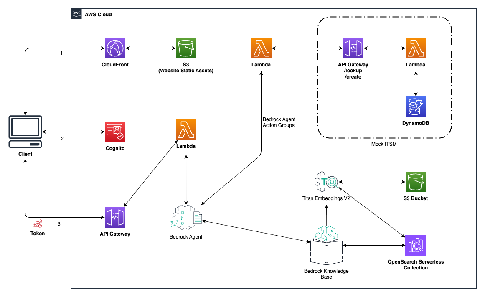

# Bedrock ITSM Chat Application

This sample solution demonstrates how Amazon Bedrock can streamline internal IT service management processes through natural language interactions. By leveraging agentic flows, the sample showcases how Generative AI can automate the complex task of navigating ticketing systems, identifying appropriate workflows, and executing actions through ITSM APIs. The solution enables internal stakeholders to effortlessly create tickets, initiate projects, and manage approvals through simple conversations, reducing manual effort and improving efficiency in organizational processes.

This solution provides a web-based chat interface for interacting with Amazon Bedrock services and includes two implementation options:

## Implementation Options

This solution offers two distinct Amazon Bedrock implementations, each designed for different use cases and technical requirements. Both provide identical functionality to end users through the same chat interface, but offer different deployment models and levels of customization.

### 1. Bedrock Agents (Prototype-Focused) - `src/bedrock-agent-itsm/`

**Best for**: Rapid prototyping and proof-of-concept development



**Key Characteristics**:
- **Deployment Model**: Fully managed AWS service with configuration-based setup
- **Infrastructure**: AWS handles all agent runtime infrastructure automatically
- **Configuration**: Declarative CloudFormation templates with minimal custom code
- **Customization**: Limited to AWS Bedrock Agent configurations and action groups
- **Maintenance**: AWS manages updates, scaling, and availability
- **Learning Curve**: Minimal - focuses on configuration over coding
- **Time to Deploy**: ~15-20 minutes with guided setup

**Ideal Use Cases**:
- Proof of concepts and rapid prototyping
- MVP development and demonstrations
- Learning Amazon Bedrock capabilities
- Quick validation of ITSM automation concepts
- Educational workshops and training
- Teams preferring configuration over custom code

### 2. Bedrock AgentCore (Production-Ready) - `src/bedrock-agentcore/`

**Best for**: Production deployments requiring enterprise-grade customization and control


**Key Characteristics**:
- **Deployment Model**: Container-based runtime with full code control
- **Infrastructure**: You manage the agent logic, AWS manages the runtime environment
- **Configuration**: Code-driven with Python and framework integration
- **Customization**: Complete control over agent behavior, tool implementation, and decision logic
- **Maintenance**: You handle agent code updates and custom logic maintenance
- **Learning Curve**: Moderate to advanced - requires container and Python knowledge
- **Time to Deploy**: ~30-45 minutes with manual container building

**Framework Support**:
- **Strands**: AWS-native agent framework (used in this implementation)
- **LangChain**: Popular open-source framework for LLM applications
- **LangGraph**: Advanced workflow orchestration for complex agent behaviors
- **Custom Frameworks**: Build your own agent logic from scratch

**Ideal Use Cases**:
- Production enterprise deployments
- Complex business logic requiring custom decision-making
- Integration with proprietary systems and APIs beyond standard ITSM
- Advanced debugging and monitoring requirements
- Teams with strong Python and containerization skills
- Organizations requiring specialized agent behaviors
- Compliance and security-sensitive environments
- High-scale deployments with custom performance requirements

This project includes the following files and folders:

- * **docs** - Directory containing supporting documents
- * **src/bedrock-agent-itsm** - Directory containing SAM template for Bedrock Agents implementation
- * **src/bedrock-agentcore** - Directory containing AgentCore container-based implementation
- * **src/chat-app** - Directory containing SAM template for the chat application frontend and API
- * **src/chat-app/web** - Directory containing the web application code for the chat interface

## Choosing Your Implementation

### Decision Matrix

| Factor | Bedrock Agents | Bedrock AgentCore |
|--------|----------------|-------------------|
| **Deployment Speed** | Fast (15-20 min) | Moderate (30-45 min) |
| **Customization** | Limited | Complete |
| **Operational Overhead** | Minimal | Moderate |
| **Learning Curve** | Easy | Moderate |
| **Framework Support** | AWS Native Only | Any Python Framework |
| **Debugging Control** | Limited | Full Access |
| **Production Readiness** | Prototype/MVP | Enterprise Production |

### When to Choose Bedrock Agents

**Choose Bedrock Agents if you**:
- Want rapid prototyping and proof-of-concept development
- Need to demonstrate ITSM automation quickly
- Prefer configuration over custom code development
- Are building an MVP or learning Amazon Bedrock capabilities
- Have limited DevOps or containerization experience
- Want AWS to handle all infrastructure management
- Are conducting educational workshops or training sessions
- Need to validate concepts before production investment

**Avoid Bedrock Agents if you**:
- Need production-grade enterprise deployment
- Require custom business logic or complex decision-making
- Want to integrate with proprietary systems or APIs
- Need detailed debugging and monitoring capabilities
- Require compliance with strict security policies
- Plan to handle high-scale production workloads

### When to Choose Bedrock AgentCore

**Choose Bedrock AgentCore if you**:
- Need production-ready enterprise deployment
- Require custom agent logic or specialized frameworks
- Want full control over agent behavior and decision-making
- Plan to integrate with custom systems or APIs beyond standard ITSM
- Have strong Python and containerization skills
- Need advanced debugging and monitoring capabilities
- Must comply with enterprise security and compliance requirements
- Require specific framework integrations (LangChain, LangGraph, Strands)
- Need to implement complex business rules or workflows
- Plan to handle high-scale production workloads

**Avoid Bedrock AgentCore if you**:
- Want the simplest possible deployment for prototyping
- Lack Python or Docker experience
- Prefer fully managed solutions for quick validation
- Don't need custom agent logic for your use case
- Want to minimize operational overhead for proof-of-concepts

### Migration Between Implementations

Both implementations share the same data layer (DynamoDB, S3, OpenSearch), making it possible to switch between them:

**From Bedrock Agents to AgentCore**:
1. Deploy the AgentCore implementation
2. Update the chat application to point to the new AgentCore endpoint
3. Existing tickets and knowledge base remain accessible
4. Optionally remove the Bedrock Agents deployment

**From AgentCore to Bedrock Agents**:
1. Deploy the Bedrock Agents implementation
2. Update the chat application to point to the Bedrock Agent
3. All existing data remains compatible
4. Optionally remove the AgentCore deployment

**Note**: Migration requires redeployment but preserves all existing ticket data and knowledge base content.

## Prerequisites

Before deploying the application, ensure you have the necessary tools installed as described in the Deployment Instructions section.

## Deployment Instructions

Choose one of the two implementation options below and follow the detailed deployment instructions in the respective README files:

### Option 1: Bedrock Agents Implementation (Recommended for prototypes)

**Best for**: Rapid prototyping and proof-of-concept development

For complete step-by-step deployment instructions, see: **[src/bedrock-agent-itsm/README.md](src/bedrock-agent-itsm/README.md)**

**Quick Overview:**
1. Deploy the Bedrock Agent ITSM template using SAM CLI
2. Upload PDF documents to S3 and sync the Knowledge Base
3. Deploy the chat application (see [src/chat-app/README.md](src/chat-app/README.md))
4. Upload web files to the S3 bucket

**Prerequisites**: SAM CLI, Node.js, Docker, AWS CLI

### Option 2: Bedrock AgentCore Implementation (Recommended for production)

**Best for**: Production deployments requiring enterprise-grade customization and control

For complete step-by-step deployment instructions, see: **[src/bedrock-agentcore/README.md](src/bedrock-agentcore/README.md)**

**Quick Overview:**
1. Validate AWS environment and service availability
2. Build container image with your agent code
3. Push container to Amazon ECR
4. Deploy CloudFormation infrastructure
5. Deploy the chat application (see [src/chat-app/README.md](src/chat-app/README.md))

**Prerequisites**: SAM CLI, Node.js, Docker, AWS CLI, Python 3.11+

### Chat Application Deployment

Both implementations use the same chat application frontend. For detailed deployment instructions, see: **[src/chat-app/README.md](src/chat-app/README.md)**

### Security Configuration (Optional)

As a best practice, you should update the API Gateway CORS setting (Access-Control-Allow-Origin) to reflect the domain of the chat-app instead of a wildcard domain ('*') to mitigate potential XSS attacks. Refer to the [CORS documentation](https://docs.aws.amazon.com/apigateway/latest/developerguide/how-to-cors.html) for more information.

## Architecture

This application supports two deployment architectures, each optimized for different use cases while sharing common infrastructure components.

### Shared Components

Both implementations utilize the same foundational infrastructure:

* **Chat Frontend** (`src/chat-app/`) - React-based web interface with Cognito authentication
* **API Gateway** - RESTful endpoints for ITSM operations (`/create`, `/lookup`)
* **DynamoDB Table** - Centralized ticket storage with consistent schema
* **S3 Bucket** - Knowledge base document storage
* **OpenSearch Serverless** - Vector database for semantic search
* **Lambda Functions** - Core ITSM business logic (create/lookup operations)

This application is composed of multiple components, each defined by its own SAM template:

### Bedrock Agents Architecture (Prototype-Focused)

The Bedrock Agents template (`src/bedrock-agent-itsm/template.yml`) creates a fully managed solution optimized for rapid prototyping:

**AWS Resources Created**:
* **Amazon Bedrock Agent** - Managed agent with built-in orchestration
* **Amazon Bedrock Knowledge Base** - Automated document indexing and retrieval
* **Action Groups** - Predefined integrations with Lambda functions
* **Amazon OpenSearch Serverless** - Managed vector database
* **Amazon DynamoDB** - Ticket storage table
* **AWS Lambda Functions** - ITSM operations and agent action handlers
* **Amazon API Gateway** - REST API for ticket operations
* **Amazon S3** - Knowledge base document storage
* **AWS IAM Roles** - Managed permissions for all services

**Deployment Characteristics**:
- Single CloudFormation stack deployment
- AWS manages agent runtime and scaling
- Configuration-based customization
- Automatic integration between services
- Built-in monitoring and logging
- Ideal for rapid iteration and testing

### Bedrock AgentCore Architecture (Production-Ready)

The AgentCore template (`src/bedrock-agentcore/template.yml`) provides an enterprise-grade runtime environment:

**AWS Resources Created**:
* **Bedrock AgentCore Runtime** - Container-based agent execution environment
* **Amazon ECR Repository** - Container image storage
* **Custom Agent Container** - Your Python agent code with Strands framework
* **Amazon OpenSearch Serverless** - Shared vector database
* **Amazon DynamoDB** - Shared ticket storage table
* **AWS Lambda Functions** - Shared ITSM operations
* **Amazon API Gateway** - Shared REST API endpoints
* **Amazon S3** - Shared knowledge base storage
* **AWS IAM Roles** - Custom permissions for container runtime

**Deployment Characteristics**:
- Multi-step deployment (container build + infrastructure)
- You manage agent code and logic
- Framework flexibility (Strands, LangChain, LangGraph)
- Direct access to agent runtime for debugging
- Custom monitoring and logging implementation
- Enterprise-grade security and compliance controls


### Chat Application Architecture (Shared)

The Chat Application template (`src/chat-app/template.yml`) provides the frontend interface used by both implementations:

**AWS Resources Created**:
* **AWS Lambda** - Function that communicates with either Bedrock Agent or AgentCore
* **Amazon API Gateway** - REST API with Cognito authorization
* **Amazon Cognito** - User pool and client for authentication
* **Amazon CloudFront** - CDN distribution for the web application
* **Amazon S3** - Static website hosting bucket
* **AWS IAM Roles** - Execution roles for Lambda functions
* **Custom Resources** - Lambda function to generate frontend configuration

**Integration Points**:
- Automatically detects which backend implementation is deployed
- Provides identical user experience regardless of backend choice
- Handles authentication and session management
- Routes requests to appropriate backend API endpoints

Both templates use AWS Serverless Application Model (AWS SAM) to define application resources. AWS SAM is an extension of AWS CloudFormation with a simpler syntax for configuring common serverless application resources such as functions, triggers, and APIs.

## Accessing the Chat Application

After deployment completes, you can find the CloudFront URL in the outputs section of the Chat App CloudFormation stack. Navigate to this URL in your browser to access the chat application.

You'll need to create a user account through the Cognito user pool before you can log in and start chatting with the Bedrock Agent.

For detailed information about accessing and using the chat application, see: **[src/chat-app/README.md](src/chat-app/README.md)**

## Fetch, tail, and filter Lambda function logs

To simplify troubleshooting, SAM CLI has a command called `sam logs`. `sam logs` lets you fetch logs generated by your deployed Lambda function from the command line. In addition to printing the logs on the terminal, this command has several nifty features to help you quickly find the bug.

`NOTE`: This command works for all AWS Lambda functions; not just the ones you deploy using SAM.

```bash
bedrock-agent-chat-app$ sam logs -n ChatLambdaFunction --stack-name bedrock-agent-chat-app --tail
```

You can find more information and examples about filtering Lambda function logs in the [SAM CLI Documentation](https://docs.aws.amazon.com/serverless-application-model/latest/developerguide/serverless-sam-cli-logging.html).

## Cleanup

To delete the sample application, use the AWS CLI. The cleanup process depends on which implementation you deployed:

### For Bedrock Agents Implementation
```bash
aws cloudformation delete-stack --stack-name bedrock-agent-chat-app
aws cloudformation delete-stack --stack-name bedrock-agent-itsm
```

### For Bedrock AgentCore Implementation
```bash
# Delete the main stacks
aws cloudformation delete-stack --stack-name bedrock-agent-chat-app
aws cloudformation delete-stack --stack-name bedrock-agentcore-itsm

# Clean up ECR repository (optional)
aws ecr delete-repository --repository-name bedrock-agentcore-itsm-agent-repo --force

# Clean up local Docker images (optional)
docker rmi bedrock-agentcore-itsm-agent:latest
```

### For Both Implementations (if you deployed both)
```bash
# Delete chat application (shared)
aws cloudformation delete-stack --stack-name bedrock-agent-chat-app

# Delete both backend implementations
aws cloudformation delete-stack --stack-name bedrock-agent-itsm
aws cloudformation delete-stack --stack-name bedrock-agentcore-itsm

# Clean up AgentCore container resources
aws ecr delete-repository --repository-name bedrock-agentcore-itsm-agent-repo --force
docker rmi bedrock-agentcore-itsm-agent:latest
```

**Note**: Shared resources (DynamoDB table, S3 buckets, OpenSearch collection) will be deleted when you remove the backend implementation stacks. Ensure you have backed up any important data before cleanup.

## Resources

See the [AWS SAM developer guide](https://docs.aws.amazon.com/serverless-application-model/latest/developerguide/what-is-sam.html) for an introduction to SAM specification, the SAM CLI, and serverless application concepts.

Next, you can use AWS Serverless Application Repository to deploy ready to use Apps that go beyond hello world samples and learn how authors developed their applications: [AWS Serverless Application Repository main page](https://aws.amazon.com/serverless/serverlessrepo/)


If you prefer to use an integrated development environment (IDE) to build and test your application, you can use the AWS Toolkit.  
The AWS Toolkit is an open source plug-in for popular IDEs that uses the SAM CLI to build and deploy serverless applications on AWS. The AWS Toolkit also adds a simplified step-through debugging experience for Lambda function code. See the following links to get started.

* [PyCharm](https://docs.aws.amazon.com/toolkit-for-jetbrains/latest/userguide/welcome.html)
* [IntelliJ](https://docs.aws.amazon.com/toolkit-for-jetbrains/latest/userguide/welcome.html)
* [VS Code](https://docs.aws.amazon.com/toolkit-for-vscode/latest/userguide/welcome.html)
* [Visual Studio](https://docs.aws.amazon.com/toolkit-for-visual-studio/latest/user-guide/welcome.html)

## Security

See [CONTRIBUTING](CONTRIBUTING.md#security-issue-notifications) for more information.

## License

This library is licensed under the MIT-0 License. See the LICENSE file.