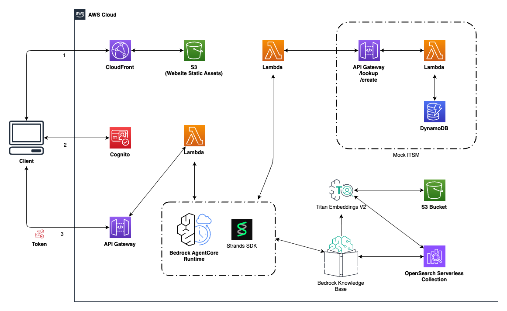

# Bedrock AgentCore ITSM Implementation

This directory contains the Bedrock AgentCore implementation of the ITSM chat solution. This approach uses a container-based runtime designed for production deployments that require enterprise-grade customization, control, and integration with frameworks like LangChain, LangGraph, and Strands.

## Overview

The AgentCore implementation provides:

* **Production-Ready Architecture**: Enterprise-grade deployment with full control over agent behavior
* **Custom Agent Logic**: Complete control using Python and the Strands framework
* **Container-Based Deployment**: Modern containerized deployment patterns for production environments
* **Framework Flexibility**: Use any Python AI framework (LangChain, LangGraph, Strands, etc.)
* **Advanced Debugging**: Direct access to agent code for debugging and monitoring
* **Enterprise Security**: Compliance-ready with custom security controls

## Architecture




## Prerequisites

Before deploying the AgentCore implementation, ensure you have:

### Required Tools
* **AWS CLI v2** - For interacting with AWS services
* **Docker** - For building container images  
* **SAM CLI** - For deploying serverless applications
* **Python 3.11+** - For running validation scripts

### Installation Commands

```bash
# Install AWS CLI (macOS)
brew install awscli

# Install Docker (macOS)
brew install docker

# Install SAM CLI
brew install aws-sam-cli

# Verify installations
aws --version
docker --version
sam --version
python3 --version
```

### AWS Configuration

```bash
# Configure AWS credentials
aws configure

# Or use a specific profile
aws configure --profile myprofile

# Verify your identity
aws sts get-caller-identity

# Or verify identity for a specific profile
aws sts get-caller-identity --profile myprofile
```

## Deployment Process

The AgentCore deployment is designed for production environments. You'll execute each step to understand and control the container-based AI agent deployment process.

### Step 1: Environment Validation

First, validate that all required AWS services are available in your target region:

```bash
# Set your target region
export AWS_REGION=us-east-1

# Check Bedrock Agent availability
aws bedrock-agent list-knowledge-bases --region $AWS_REGION --max-results 1

# Check other required services
aws dynamodb list-tables --region $AWS_REGION --limit 1
aws s3 ls
aws opensearch list-domain-names --region $AWS_REGION
aws apigateway get-rest-apis --region $AWS_REGION --limit 1
aws lambda list-functions --region $AWS_REGION --max-items 1
aws ecr describe-repositories --region $AWS_REGION --max-results 1
```

**Expected Results:**
* Each command should return successfully (not "service not available" errors)
* You may see "AccessDenied" errors - this is normal if you don't have data yet
* "UnauthorizedOperation" errors indicate the service is available but you need permissions

### Step 2: Container Preparation

Navigate to the AgentCore directory:

```bash
cd src/bedrock-agentcore-itsm
```

Create a Dockerfile for the AgentCore runtime:

```bash
cat > Dockerfile << 'EOF'
FROM public.ecr.aws/lambda/python:3.11

# Install system dependencies
RUN yum update -y && yum install -y gcc

# Copy requirements and install Python dependencies
COPY requirements.txt ${LAMBDA_TASK_ROOT}
RUN pip install -r requirements.txt

# Copy agent code
COPY agent/ ${LAMBDA_TASK_ROOT}/agent/

# Set the CMD to your handler
CMD ["agent.strands_agent.handler"]
EOF
```

Build the container image:

```bash
# Build the container image
docker build -t bedrock-agentcore-itsm-agent .

# Verify the image was created
docker images | grep bedrock-agentcore-itsm-agent
```

### Step 3: ECR Repository Setup

Create an ECR repository and push your container:

```bash
# Set repository name
export REPO_NAME=bedrock-agentcore-itsm-agent-repo

# Create ECR repository
aws ecr create-repository \
    --repository-name $REPO_NAME \
    --region $AWS_REGION

# Get your AWS account ID
export ACCOUNT_ID=$(aws sts get-caller-identity --query Account --output text)

# Set the full image URI
export IMAGE_URI=$ACCOUNT_ID.dkr.ecr.$AWS_REGION.amazonaws.com/$REPO_NAME:latest

echo "Image URI: $IMAGE_URI"
```

Push the container to ECR:

```bash
# Get ECR login token and login to Docker
aws ecr get-login-password --region $AWS_REGION | docker login --username AWS --password-stdin $ACCOUNT_ID.dkr.ecr.$AWS_REGION.amazonaws.com

# Tag your local image with the ECR URI
docker tag bedrock-agentcore-itsm-agent:latest $IMAGE_URI

# Push the image to ECR
docker push $IMAGE_URI

# Verify the push
aws ecr describe-images --repository-name $REPO_NAME --region $AWS_REGION
```

### Step 4: CloudFormation Deployment

Deploy the CloudFormation stack:

```bash
# Set deployment parameters
export STACK_NAME=bedrock-agentcore-itsm
export CONTAINER_IMAGE_URI=$IMAGE_URI

# Deploy the CloudFormation stack
sam deploy \
    --template-file template.yml \
    --stack-name $STACK_NAME \
    --capabilities CAPABILITY_IAM \
    --region $AWS_REGION \
    --parameter-overrides ContainerImageUri=$CONTAINER_IMAGE_URI \
    --no-confirm-changeset
```

Monitor the deployment progress:

```bash
# Watch the deployment progress
aws cloudformation describe-stack-events \
    --stack-name $STACK_NAME \
    --region $AWS_REGION \
    --query 'StackEvents[*].[Timestamp,ResourceStatus,ResourceType,LogicalResourceId]' \
    --output table

# Check final deployment status
aws cloudformation describe-stacks \
    --stack-name $STACK_NAME \
    --region $AWS_REGION \
    --query 'Stacks[0].StackStatus' \
    --output text
```

### Step 5: Verify Deployment

Get the stack outputs and test the deployment:

```bash
# Get all stack outputs
aws cloudformation describe-stacks \
    --stack-name $STACK_NAME \
    --region $AWS_REGION \
    --query 'Stacks[0].Outputs[*].[OutputKey,OutputValue]' \
    --output table

# Get the API endpoint
export API_ENDPOINT=$(aws cloudformation describe-stacks \
    --stack-name $STACK_NAME \
    --region $AWS_REGION \
    --query 'Stacks[0].Outputs[?OutputKey==`ApiEndpoint`].OutputValue' \
    --output text)

echo "API Endpoint: $API_ENDPOINT"
```

Test the API:

```bash
# Test ticket creation
curl -X POST $API_ENDPOINT/create \
    -H "Content-Type: application/json" \
    -d '{
        "tickettype": "INC",
        "description": "Test ticket from AgentCore deployment",
        "impact": "Low",
        "urgency": "Low"
    }'

# Test ticket lookup (use the ticket number from the create response)
curl -X GET "$API_ENDPOINT/lookup?ticketNumber=INC12345678"
```

### Step 6: Deploy Chat Application

The chat application is shared between both implementations. Navigate to the chat app directory and deploy:

```bash
cd ../chat-app

sam build
sam deploy --guided --capabilities CAPABILITY_NAMED_IAM
```

Upload the web files:

```bash
# Get the S3 bucket name from CloudFormation outputs
export WEB_BUCKET=$(aws cloudformation describe-stacks \
    --stack-name bedrock-agent-chat-app \
    --region $AWS_REGION \
    --query 'Stacks[0].Outputs[?OutputKey==`S3BucketName`].OutputValue' \
    --output text)

# Upload web files
aws s3 cp web/ s3://$WEB_BUCKET/ --recursive
```

## Understanding the Components

### Agent Implementation (`agent/strands_agent.py`)
The main agent class that orchestrates tool usage and handles user requests using the Strands framework.

### Tools (`agent/tools/`)
* **create_ticket.py**: Handles ticket creation requests
* **lookup_ticket.py**: Handles ticket lookup requests  
* **knowledge_base.py**: Handles knowledge base queries

### Shared Functions (`functions/`)
Lambda functions that provide the same ITSM API as the Bedrock Agents implementation, ensuring data compatibility.

### Infrastructure (`template.yml`)
CloudFormation template that defines the AgentCore runtime, shared resources, and IAM permissions.

## Troubleshooting

### Container Build Issues
```bash
# Check Docker daemon
docker info

# Clean Docker cache
docker system prune -f

# Rebuild without cache
docker build --no-cache -t bedrock-agentcore-itsm-agent .
```

### ECR Push Issues
```bash
# Re-authenticate with ECR
aws ecr get-login-password --region $AWS_REGION | docker login --username AWS --password-stdin $ACCOUNT_ID.dkr.ecr.$AWS_REGION.amazonaws.com

# Verify repository exists
aws ecr describe-repositories --repository-names $REPO_NAME --region $AWS_REGION
```

### CloudFormation Issues
```bash
# Check detailed error messages
aws cloudformation describe-stack-events \
    --stack-name $STACK_NAME \
    --region $AWS_REGION \
    --query 'StackEvents[?ResourceStatus==`CREATE_FAILED`].[ResourceStatusReason,LogicalResourceId]' \
    --output table
```

## Rollback

To rollback the deployment:

```bash
# Delete CloudFormation stack
aws cloudformation delete-stack \
    --stack-name $STACK_NAME \
    --region $AWS_REGION

# Clean up ECR repository (optional)
aws ecr delete-repository \
    --repository-name $REPO_NAME \
    --region $AWS_REGION \
    --force

# Clean up local Docker images
docker rmi bedrock-agentcore-itsm-agent:latest $IMAGE_URI
```

## Learning Objectives

By completing this deployment, you'll gain:

* Production-ready container-based AI agent deployment experience
* ECR repository management and Docker workflows for enterprise environments
* CloudFormation parameter management for production deployments
* AWS service integration and enterprise IAM permission management
* Debugging and monitoring capabilities for containerized applications
* Infrastructure as Code best practices for production systems

## Next Steps

After successful deployment:

1. **Explore the Code**: Examine the production-ready agent and tool implementations
2. **Customize the Agent**: Modify the agent logic for your enterprise use cases
3. **Add New Tools**: Extend the agent with additional enterprise capabilities
4. **Monitor Performance**: Set up production-grade CloudWatch dashboards and alarms
5. **Security Review**: Review IAM permissions and implement enterprise security configurations
6. **Scale for Production**: Configure auto-scaling and high-availability settings

This production-focused approach provides the foundation for building enterprise-ready AI applications with full control and customization capabilities.